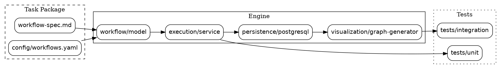
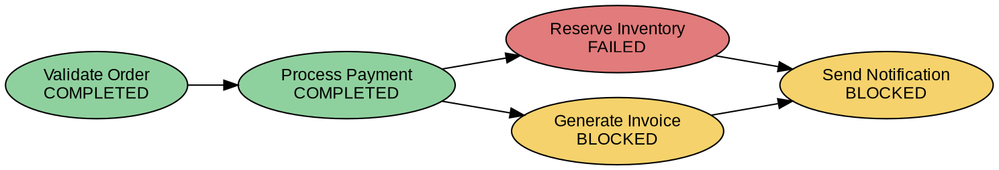

# Task Proposal 1

## Title
Dynamic Workflow Execution Engine with Runtime Graphviz Visualization

## Objective
Build a configurable workflow execution service that executes dependent workflow steps, persists runtime state in PostgreSQL, and generates a Graphviz representation of the current execution state for a specific workflow run. The graph must reflect live workflow states such as `COMPLETED`, `RUNNING`, `PENDING`, `FAILED`, and `BLOCKED` based solely on persisted database state.

Each workflow execution must have a unique run identifier, and duplicate execution requests for the same workflow run and step must be handled idempotently.

## Background
This task proposal defines a synthetic starter project package for a realistic backend engineering exercise. The implementation uses Visual Studio Code plus Graphviz, and it combines configuration-driven workflow logic, stateful execution, data persistence, retry/failure handling, and runtime visualization.

## Starting Materials
The task package is expected to contain the following starter scaffold:

```
workflow-engine/
├── README.md
├── workflow-spec.md
├── architecture.dot
├── config/
│   └── workflows.yaml
├── src/
│   ├── workflow/
│   ├── execution/
│   ├── persistence/
│   └── visualization/
├── tests/
│   ├── unit/
│   └── integration/
├── test-data/
└── docker-compose.yml
```

The starter package should include:

- PostgreSQL schema definitions and persistence entities
- Incomplete workflow engine implementation and state transition skeletons
- Initial unit and integration test skeletons
- `workflow-spec.md` defining workflow dependencies, retry rules, failure behavior, and state semantics
- A baseline Graphviz architecture diagram in `architecture.dot`
- A YAML workflow configuration file in `config/workflows.yaml`

## Task Scope
The completed implementation must:

- load workflow definitions from configuration
- assign a unique run ID to each workflow execution
- enforce idempotent execution for duplicate step requests within the same run
- execute dependent steps in the correct order
- allow independent steps to execute in parallel when permitted by dependency rules
- persist step status and metadata atomically to PostgreSQL
- apply retry semantics for transient failures
- mark downstream steps as `BLOCKED` when a prerequisite fails permanently
- generate a runtime Graphviz/DOT file from persisted workflow state for a specific workflow run
- include representative unit and integration tests

## Architecture Overview
The system should be structured into these logical layers:

- `workflow/`: workflow definition parsing, dependency graph modeling, and transition rules
- `execution/`: step orchestration, concurrency, retries, idempotency, and blocking logic
- `persistence/`: PostgreSQL entities, schema migrations, and runtime state storage
- `visualization/`: Graphviz generation from persisted workflow state

### Architecture Diagram



## Expected Workflow
The candidate should complete the task through these major stages:

1. Review the starter package and workflow specification.
2. Understand the PostgreSQL schema and persisted workflow state model.
3. Run supplied tests and identify missing or incomplete behavior.
4. Implement state transition logic for workflow steps.
5. Add dependency sequencing and parallel execution for independent steps.
6. Persist step state changes with run ID, timestamps, and retry metadata.
7. Implement failure handling, retry behavior, idempotency, and blocked downstream propagation.
8. Generate Graphviz/DOT output from the current persisted state of a specific workflow run.
9. Validate generated graphs against expected runtime scenarios.
10. Complete or extend unit and integration tests for success, failure, retry, and blocked flows.
11. Provide representative workflow run output and generated graph artifacts.

## Runtime State Model
The workflow should support this explicit state model:

- `PENDING`
- `RUNNING`
- `COMPLETED`
- `FAILED`
- `BLOCKED`
- `RETRYING`

Example transitions:

- `PENDING` → `RUNNING`
- `RUNNING` → `COMPLETED`
- `RUNNING` → `FAILED`
- `FAILED` → `RETRYING` → `RUNNING`
- `FAILED` → `BLOCKED` for downstream dependents

A failed step with a retry policy should re-enter `RUNNING` via a retry cycle. A permanent failure should prevent dependent steps from starting and mark them `BLOCKED`.

## Parallel Execution Example
The workflow should allow independent concurrent steps once prerequisites are satisfied. For example:

```text
            Process Payment
             /         \
            ↓           ↓
   Reserve Inventory   Generate Invoice
             \         /
              ↓       ↓
           Send Notification
```

In this example, `Reserve Inventory` and `Generate Invoice` may execute concurrently after `Process Payment` completes. `Send Notification` must wait for both predecessors.

## Runtime Graphviz Requirement
Generate the Graphviz representation from the current persisted workflow state for a specific workflow run. The visualization must be derived from PostgreSQL state and must not be a pre-defined static architecture diagram.

A valid runtime graph should represent:

- node labels with step names and current state
- edge relationships between dependent steps
- distinct visual styling for `COMPLETED`, `RUNNING`, `PENDING`, `FAILED`, and `BLOCKED`

## Example Runtime State
A workflow run should be able to produce states like the following:

- **Successful path**
  - `Validate Order` → `COMPLETED`
  - `Process Payment` → `COMPLETED`
  - `Reserve Inventory` → `RUNNING`
  - `Generate Invoice` → `PENDING`
  - `Send Notification` → `PENDING`

- **Failure path**
  - `Validate Order` → `COMPLETED`
  - `Process Payment` → `COMPLETED`
  - `Reserve Inventory` → `FAILED`
  - `Generate Invoice` → `BLOCKED`
  - `Send Notification` → `BLOCKED`

The runtime Graphviz output must reflect this persisted state, with node styles or labels matching actual runtime values.

## Runtime State Graph Example



## Challenge Dimensions
- **Cross-source reasoning**
  - Reconcile requirements across the workflow specification, configuration files, source code, database schema, tests, and architecture diagram.
- **Multi-item state tracking**
  - Manage multiple workflow steps that may execute concurrently or wait on dependencies, with independent step state transitions.
- **Dynamic environment**
  - Derive visualization from the current persisted execution state rather than from a static design artifact.
- **Idempotency and state consistency**
  - Prevent duplicate executions of the same step within a workflow run and maintain consistent persisted state.

## Deliverables
The completed submission should include:

- Source implementation of the workflow execution engine
- Configurable workflow definitions and reusable run ID handling
- PostgreSQL persistence and schema objects
- Retry and failure handling with blocked-step propagation
- Runtime Graphviz/DOT generation from persisted workflow state
- Representative generated workflow graphs for success and failure scenarios
- Unit and integration tests covering dependencies, parallelism, retries, blocking, and idempotency
- Execution logs or run output for the example workflow runs
- Short implementation summary describing key design decisions

## Evaluation Rubric

| Criterion | Weight |
|---|---|
| Project builds and runs | 5% |
| Workflow / state-machine behavior | 20% |
| Dependency and parallel execution | 15% |
| PostgreSQL state persistence | 15% |
| Failure / retry / blocking behavior | 15% |
| Runtime Graphviz visualization | 10% |
| Automated tests | 15% |
| Code quality / observability | 5% |

Total: `100%`

## Rationale
This task is scoped as a `1.5–2 hour` engineering exercise because it requires:

- understanding a scaffolded starter package
- reasoning across functional specification, configuration, and persistence
- implementing business logic for a stateful workflow engine
- handling success, failure, retries, blocking, and idempotent execution
- persisting state in PostgreSQL
- generating live visualization from persisted workflow state
- providing tests that validate runtime behavior

The runtime Graphviz output is an operational view of workflow execution, not static documentation.

## Estimated Effort
This task is designed to require about `1.5–2 hours` for a skilled engineer to complete.

```
             ┌──────────────────┐
             │ Workflow Config  │
             └────────┬─────────┘
                      ↓
             ┌──────────────────┐
             │ Workflow Engine  │
             └───────┬──────────┘
                     │
           ┌─────────┴─────────┐
           ↓                   ↓
   Execution/State       PostgreSQL
                           State
                             │
                             ↓
                    Graphviz Generator
                             │
                             ↓
                       Runtime DOT
```
